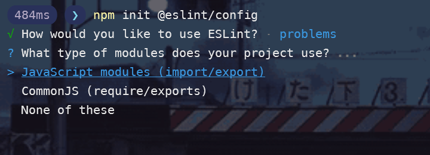
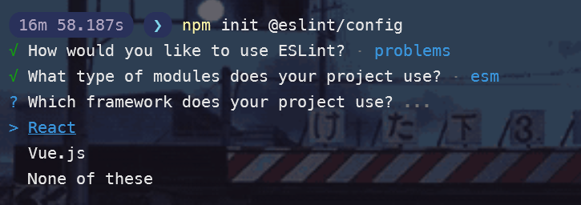
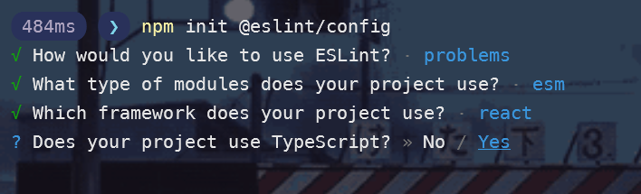
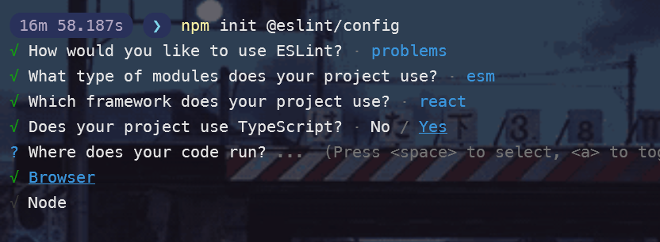
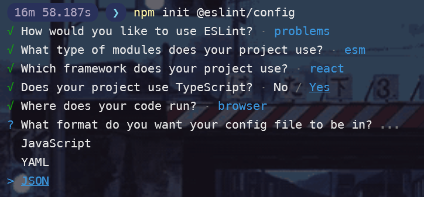
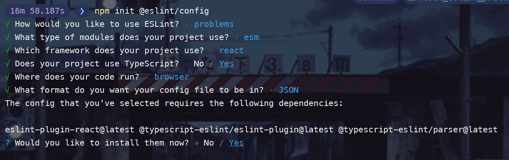
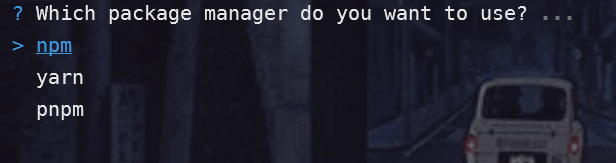

# Eslint, Prettier e EditorConfig💅🏽

Setup básico do Eslint, Prettier e EditorConfig para projetos em nodeJS.


## :warning: Aviso

Verifique se possui instalado no seu *vs code* as seguintes extensões antes de continuar:

1. Eslint
2. Prettier - Code formatter

## Instalação

### Eslint 🧰

Este comando vai iniciar as configurações do eslint.

```javascript
npm init @eslint/config
```

Com isso serão exibidas 3 opções no terminal:

<p align="left">
 
</p>

Vamos escolher a segunda opção, pois o prettier que ficara responsável por corrigir o estilo de código para o padrão definido. Após isso, teremos que responder qual tipo de import é usado no projeto.

<p align="left">
 
</p>

Ficaremos com a primeira opção. Agora teremos que informar se estamos utilizando algum tipo de framework, como React ou Vue. 

<p align="left">
 
</p>

Trabalharemos com o react, então escolheremos a primeira opção. **Um aviso: no caso do *Express*, não vamos escolher nenhum framework obviamente.**

A pergunta a seguir é se estamos usado o TypeScript no projeto.

<p align="left">
 
</p>

Vamos trabalhar sim, então escolha `yes`. A próxima pergunta será referente ao lugar aonde sua aplicação está rodando.

<p align="left">
 
</p>

No nosso caso será em browsers. **No caso do *Express*, escolheremos o node.**

<p align="left">
 
</p>

Irei escolher json por questão de costume. Agora ele está perguntando se queremos instalar algumas dependências que será preciso.

<p align="left">
 
</p>

Vamos instalar sim. Agora ele quer saber qual gerenciador usar. Usaremos o `npm`.

<p align="left">
 
</p>

Pronto, agora temos a parte do ESLint configurada, sendo assim, precisamos instalar agora Prettier.

Mas antes, crie o arquivo `.eslintignore` e adicione a `node_module`. Com o `.eslintignore` ignoremos a `node_module`.

### Prettier 📌

Instalaremos o **Prettier** que será nosso formatador e junto com ele também instalaremos o **eslint-config-prettier** e   **eslint-plugin-prettier** que garantira que o **Prettier** e o **Eslint** não entrem em conflito.

```javascript
npm install -D prettier eslint-config-prettier eslint-plugin-prettier
```

Agora, vamos ir no `eslintrc.json` e vamos adicionar as seguintes linhas:

```json
"extends": [
  "prettier",
  "plugin:prettier/recommended"
],

"plugins": [
  "prettier"
],

"rules": {
  "react/react-in-jsx-scope": "off"
}
```

E por fim, crie o arquivo `.prettierrc.json` e adicione as seguistes regras.

```json
    "arrowParens": "always",
    "bracketSpacing": true,
    "jsxSingleQuote": false,
    "printWidth": 100,
    "proseWrap": "always",
    "quoteProps": "as-needed",
    "semi": true,
    "singleQuote": false,
    "tabWidth": 2,
    "trailingComma": "es5",
    "useTabs": false,
    "endOfLine": "auto"
```

### EditorConfig 🐭

E por ultimo, mas não menos importante, o editorConfig.

Crie o `.editorconfig` e adicione as seguintes regras.

```shell
root = true

[*]
indent_style = space
indent_size = 2
end_of_line = lf
charset = utf-8
trim_trailing_whitespace = false
insert_final_newline = false
```

Ufa, terminamos. Setup pronto para iniciar os trabalhos 😌
